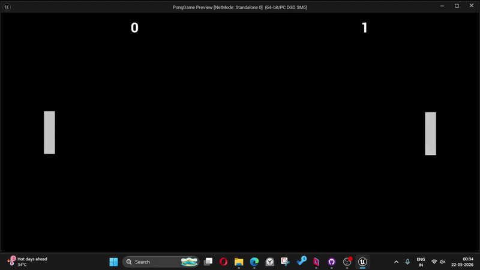

## UE5 Pong Blueprint Sample

A small Pong game made in Unreal Engine 5 using Blueprints.

## Author
Ram  
Unreal Engine Gameplay Developer

## GitHub:
https://github.com/ram007t

## UE Version
5.6

## Project Type
Blueprint learning sample

## Purpose
Community reference / learning

## Features
- Player Paddle movement
- AI Paddle behavior
- Ball collision
- Score system
- Restart flow
- Basic game loop
- Win/Lose Condition

## Notes
This project is shared for learning purposes and may contain simple implementations intended for beginners.

## Future plan:
Rebuild the same project in UE C++ as practice.
